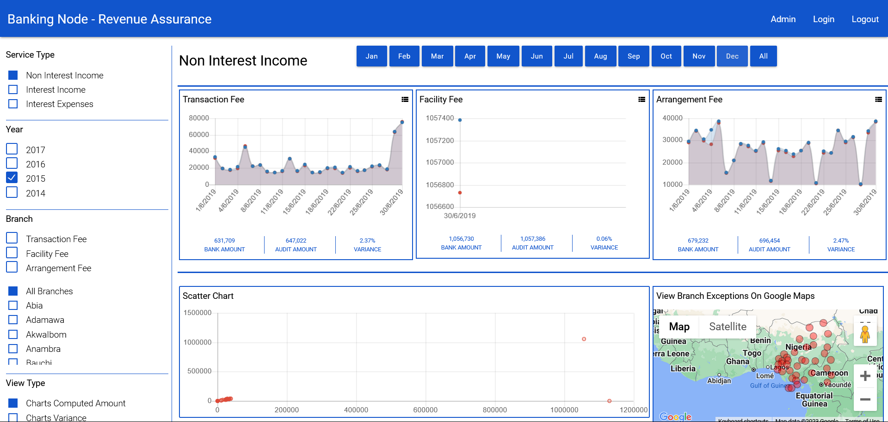

# Revenue Assurance Analytics and Reporting Solution

This project is a revenue assurance analytics and reporting solution built using AngularJS. It aims to create an intuitive Analytics Dashboard that provides actionable insights to the business.

## Screenshots

Placeholder for project screenshots.

## Features

- Analytics Dashboard: Provides a comprehensive view of revenue data with interactive charts and graphs.
- Actionable Insights: Offers meaningful insights and trends to facilitate decision-making.
- Improved Performance: Rewritten using AngularJS for better performance, scalability, and maintainability.
- Code Organization: AngularJS enables better organization and modularization of code.
- Two-Way Data Binding: AngularJS's two-way data binding allows for real-time updates and synchronization between the view and model.
- Dependency Injection: AngularJS's dependency injection simplifies component management and facilitates testing and debugging.

## Prerequisites

Before running the project, ensure that you have the following prerequisites:

- Node.js: Install Node.js from [https://nodejs.org](https://nodejs.org) if not already installed.

## Installation

Follow these steps to set up and run the project:

1. Clone the repository: `git clone https://github.com/momanyisamuel/finance.git`
2. Navigate to the project directory: `cd project-directory`
3. Install the dependencies: `npm install`
4. Start the development server: `npm start`
5. Open the application in your browser at [http://localhost:3000](http://localhost:3000)

## Usage

Once the application is running, follow the steps below to use the Revenue Assurance Analytics and Reporting Solution:

1. Open your web browser and go to [http://localhost:3000](http://localhost:3000)
3. Explore the Analytics Dashboard to view revenue data, charts, and graphs.
4. Use the interactive features to analyze the data and gain insights.
5. Generate reports and export them for further analysis or presentation.

## Contributing

We welcome contributions to enhance the Revenue Assurance Analytics and Reporting Solution. To contribute, follow these steps:

1. Fork the repository.
2. Create a new branch for your feature or improvement.
3. Make your changes and commit them.
4. Push your changes to your forked repository.
5. Submit a pull request to the main repository.

## License

This project is licensed under the MIT License.